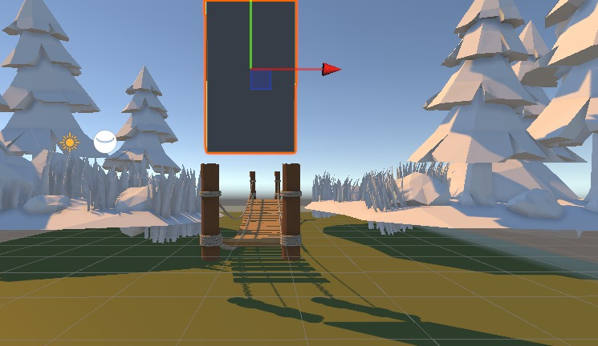

# **Takım İsmi**

Takım Unity 52

# Ürün İle İlgili Bilgiler

## Takım Elemanları
- Arif Can Ayerdem: Scrum Master / Developer
- Ece İdaci: Developer /  Product Owner
- Yağız Kağan Sarıkan: Developer
- Doğa Köseer: Devoloper and Game Artist (Hastanede kaldığı için şuan araştırma kısmında)
- Furkan Alliş:Devoloper

## Ürün İsmi

--⚡ Eternal Odyssey ⚡--

## Ürün Açıklaması

"Eternal Odyssey", sizi keşif dolu bir deniz yolculuğuna çıkaracak heyecan verici bir macera oyunudur. Bu büyüleyici dünyada, cesur bir kahraman olarak, adalara gitmek, zorlu denizleri aşmak ve gizemli adalarda eşsiz görevler üstlenmek için çağrılıyorsunuz.

Denizin sonsuz maviliğine açıldığınızda, kendi geminizi kurabilir ve adalar arasında seyahat ederken karşılaşacağınız tehlikelerle başa çıkabilecek becerileri geliştirebilirsiniz. Korsan saldırıları, vahşi deniz canavarları ve hatta gizli enginlerdeki esrarengiz tuzaklarla karşılaşacaksınız. Ancak cesaretiniz ve becerilerinizle bu zorlukları aşabilir ve adalara ulaşabilirsiniz.

Her adada, farklı bir atmosfer ve keşfedilmeyi bekleyen sırlarla dolu bir ortam sizi bekliyor olacak. Antik tapınaklar, terk edilmiş mağaralar, egzotik bitki örtüsü ve daha fazlasını içeren çeşitli adalar keşfedebilirsiniz. Her adada, yerli halkın taleplerini yerine getirmek, kayıp hazine parçalarını bulmak veya gizli geçitleri keşfetmek gibi görevlerle meşgul olacaksınız.

"Eternal Odyssey", keşif, macera ve heyecan dolu bir deniz yolculuğuna çıkmak isteyen herkes için unutulmaz bir deneyim sunuyor. Kendi hikayenizi yazmak, adalarda yeraltı hazinelerini bulmak ve denizlerin efendisi olmak için bu benzersiz dünyaya adım atın!

- **Uygulama birincil fonksiyonu**: "Eternal Odyssey" adlı oyun, oyunculara adalar arasında muhteşem bir seyahat deneyimi sunarak keşif ve macera dolu bir dünyaya adım atmalarını sağlar.

- **Uygulama ikincil fonksiyonu**: "Adaların Engelleri: Zorlukları Aş!" , oyuncular adaları keşfederken karşılarına çıkan zorlukları aşarak engelleri geride bırakacaklar.

Her adada farklı türden engellerle karşılaşacak olan oyuncular, mantık bulmacalarını çözmek, tehlikeli bölgeleri geçmek ve becerilerini kullanarak adaların sırlarını ortaya çıkarmak için mücadele edecekler.

## Ürün Özellikleri

- Geniş Adalar Dünyası: Oyunda, keşfedilmeyi bekleyen geniş adalar dünyasında seyahat edeceksiniz. Her ada benzersiz özelliklere ve keşfedilmeyi bekleyen gizemlere sahip olacak. Farklı iklimler, doğal güzellikler ve zorlu engellerle dolu adalarda macera dolu bir deneyim yaşayacaksınız.
- Engelleri Aşma ve Bulmacalar: Oyunda, adalar arasında seyahat ederken karşılaşacağınız çeşitli engelleri aşmanız gerekecek. Tehlikeli mağaraları keşfetmek, enginleri geçmek, yüksek dağlara tırmanmak gibi zorluklarla karşılaşacaksınız. Ayrıca, her adada bulunan bulmacaları çözerek ilerleyecek ve sırları açığa çıkaracaksınız. Mantık becerilerinizi kullanarak engelleri aşacak ve ödülleri elde edeceksiniz.
- Gerçekçi Tekne Kontrolleri: Oyunda, gerçekçi ve detaylı tekne kontrolleriyle heyecan verici bir tekne sürme deneyimi yaşayacaksınız. Rüzgarın etkisiyle yelkenlerinizi ayarlayacak, dalgaların üzerinden ustalıkla geçecek ve teknenizin hızını, manevra kabiliyetini ve dengeyi doğru bir şekilde kontrol edeceksiniz. Sürükleyici fizik motoruyla donatılmış olan oyunda, teknenizin gerçekçi bir şekilde davranması size gerçek bir denizdeymiş gibi hissettirecek.
- 

## Hedef Kitle

- Macera Severler
- Denizcilik Tutkunları
- Keşif Meraklıları
- Strateji Oyuncuları 
- Çok Oyunculu Oyun Severler
- Keşfetmeye İlgili Eğitici Oyun Oyuncuları

## Juriye Not

Bazı toplantılar yüz yüze yapılmış olup herhangi bir belge ile desteklenmemiştir.Bu nedenle elimizde kısıtlı görev dağılım verisi bulunmaktadır.Böyle durumlar karşısındaki yapmamız gereken şeyleri unuttugumuz için ekip adına özür dilerim.Daha mekanikler hakkında araştırmalar ve çizimler yapılıyor 2.sprinte çizimler ve araştırmalar  eklenecektir.

---

# Sprint 1

- **Sprint içinde tamamlanması tahmin edilen puan**: 100 Puan

- **Puan tamamlama mantığı**: Toplamda proje boyunca tamamlanması gereken 340 puanlık backlog bulunmaktadır. 3 sprint'e bölündüğünde ilk sprint'in en azından 100 ile başlaması gerektiğine karar verildi.

- **Daily Scrum**: Daily Scrum toplantılarının zamansal sebeplerden ötürü Whatsapp ve Dc üzerinden yapılmasına karar verilmiştir. Daily Scrum toplantısı örneği Product Backlog olarak Readme'de tarafımızdan paylaşılmaktadır: 

- **Sprint board update**: Sprint board screenshotları:  Product Backlog kısmında ekran görüntülerinden görebilirsiniz.

- **Ürün Durumu**: Ekran görüntüleri:
  
  
  
  
   
- **Sprint Review**: 
Alınan kararlar: Yeni Düzenlemeler oluşturulup yeni toplantılar ayarlanmış olup ekipçe sahne tasarlanmalarına geçilecektir.

- **Sprint Retrospective:**
  - Roller ile ilgili düzenleme yapılmış, scrum master değişmiştir.
  - Takım içindeki görev dağılımıyla ilgili düzenleme yapılması kararı alınmıştır.
  - Takım üyelerinin gelecek sprintlerde aktif olması gerektiğine vurgu yapılmıştır.
 

---

## Product Backlog : Ekran görüntüleri:

---

##Detaylar :

-Sprintler hakkında bilgilere ulaşmak isterseniz asset dosyası içinde ProjectManagement kısmından ulaşabilirsiniz şuanlık sadece 1.sprint oldugu için dosyalara bölünmemiştir.
-Tekrardan hatırlatma adına yüz yüze yapılan yoplantılardaki bilgiler buraya eklenmemiştir.

